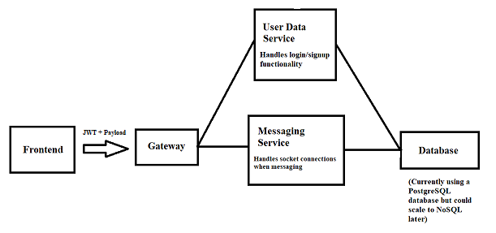

# Overview:

### A generalized chat web application allowing users to:  ###

	* create an account
	* log in
	* enter rooms through public rooms or private rooms that can be accessed with a code
	* send text messages in rooms
	* send friend requests to users
	* accept friend requests
	* message users they are friends with

### Stack/Technologies:

	-(Desktop) Frontend:
		React/JavaScript
	-Gateway	
		NodeJS/Express
	-Messaing Service:
		NodeJS
	-Login/User Service:
		Spring Boot/Java
	-Database:
		PostgreSQL

### Running commands:
	Gateway:
		Run:
			npm run start
	
	Frontend:
		Run:
			npm start 
		Test
			npm test -- --coverage --watchAll=false
	
	Messaging Service:
		Run:
			node index.js
	
	Login/User Service:
		Run:
			gradlew bootRun
		Test
			gradlew test 

### Architecture (Initial/Simplified)

### Local Development Environment Variables
	DATABASE_HOST - Database hostname
	DATABASE_NAME - Name of the database to be operated on 
	DATABASE_PASSWORD - password for database access
	DATABASE_PORT - port number for accessing the database
	DATABASE_USERNAME - username for database access
	JWT_SIG - secret key for jwt 
	
### Local Hosting port setup
	Frontend: 3000 (modify 'start' command in forum_application\frontend\package.json)
	Login/User Service: 8081 (forum_application\backend\backend\src\main\resources\application.properties)
	Messaing Service: 8080
	Database: 5432 (Postgres setup)
	Gateway: 4000

### Tools
- https://dbdiagram.io/home (Helpful for database scehma visualization)	

### Resources (for ideas/info on implementation):
- https://studygyaan.com/spring-boot/how-to-connect-postgresql-database-in-spring-boot-project
- https://www.amarjanica.com/externalize-sql-statements-in-java
- https://medium.com/@xoor/jwt-authentication-service-44658409e12c
- https://medium.com/@davidtranwd/login-flow-with-react-and-redux-9a7d07be270e
- https://tsh.io/blog/how-to-scale-websocket/
- https://haris-zujo.medium.com/spring-cloud-gateway-request-filtering-and-redirection-9e4b6d559d1a
- https://medium.com/geekculture/create-an-api-gateway-using-nodejs-and-express-933d1ca23322